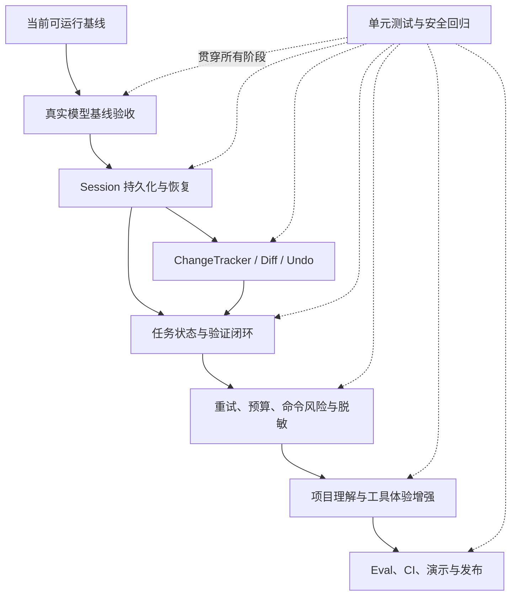

# Mini Coder Agent 能力路线图

本文档用于指导 Mini Coder Agent 后续实现。路线图按能力之间的依赖关系排序，不绑定具体日期。每个阶段都给出目标能力、实现任务和验收标准；开发时按顺序推进，并在完成后勾选对应项目。

## 1. 项目目标

Mini Coder Agent 的目标不是复刻 Codex 的全部产品能力，而是实现一个规模可控、核心逻辑可检查、能完成真实编程任务的小型 Coding Agent。

达到考核提交标准时，它应当具备以下特征：

1. **可运行**：能够连接真实模型，完成读取、修改、执行测试和总结的完整闭环。
2. **可恢复**：任务中断后可以从持久化 Session 恢复，不丢失有效上下文，也不盲目重复副作用。
3. **可审查**：文件修改有统一 Diff、审批记录、快照和冲突检测。
4. **可验证**：本地能够判断任务是否经过有效验证，而不是仅相信模型声称“已经完成”。
5. **可控制**：模型调用、命令执行、运行时间、输出大小和重试次数都有明确上限。
6. **可解释**：关键状态、工具调用、错误、重试和最终结果可以通过结构化事件查看。
7. **有安全边界**：工作区、敏感文件、命令风险、日志脱敏和人工审批共同构成分层防护。
8. **有评测证据**：通过自动化测试、真实模型 Eval、CI 和演示任务证明能力，而不只罗列功能。

## 2. 实现原则

- 不依赖 LangChain、AutoGen、OpenAI Agents SDK 等 Agent 框架；核心循环由项目自行实现。
- 模型负责推理和选择下一步，本地代码负责权限、状态、执行、持久化和客观验证。
- 先保证单 Agent 闭环可靠，再考虑扩展工具数量或更复杂的 Agent 结构。
- 所有外部副作用必须可识别、可审批、可记录；无法可靠分类时采用更保守的策略。
- API Key 不写入配置、Session、日志、Eval 报告或 Git 仓库。
- 每个里程碑都必须附带自动化测试，并尽量形成一个职责单一的提交。
- 真实模型暴露的兼容性问题应匿名化并固化为离线回归测试。
- README 中的能力描述必须与已经实现和验证的行为一致。

## 3. 能力依赖关系



如果时间有限，优先完成 B～F，再完成 H。阶段 G 属于竞争力增强项，可以根据剩余时间裁剪。

---

## 4. 阶段 A：当前可运行基线

### 目标能力

形成一个不依赖 Agent 框架、可以调用模型和本地工具、具备基础安全控制的最小完整 Agent。

### 已完成

- [x] 建立与厂商无关的 `ModelClient` 抽象。
- [x] 实现 `OpenAICompatibleClient`。
- [x] 支持 Responses 与 Chat Completions 两种 wire API。
- [x] 支持 provider TOML、环境变量和本地忽略的 `auth.json`。
- [x] 实现 Agent 工具循环和工具结果回传。
- [x] 实现文件列举、读取、搜索、写入和精确编辑工具。
- [x] 实现本地命令执行工具。
- [x] 实现工具参数校验和未知参数拒绝。
- [x] 实现工作区路径限制和常见敏感文件过滤。
- [x] 实现默认人工审批与受控目录 `--auto` 模式。
- [x] 实现最大步骤数和连续重复工具调用检测。
- [x] 实现命令超时、输出截断和模型密钥环境变量隔离。
- [x] 实现基础上下文压缩，并保持工具调用消息配对合法。
- [x] 实现可选 JSONL 事件日志。
- [x] 建立 24 项离线单元测试。
- [x] 初始化 Git，完成公开仓库和首轮推送。

### 基线之后需要补齐

- [x] 已在 `docs/runs/baseline-responses-run.md` 保存经过脱敏的真实模型端到端运行记录。
- [x] 任务状态已通过版本化 Session 落盘，并具备安全恢复入口。
- [ ] 写操作没有面向用户的统一 Diff 和 Session 级 Undo。
- [ ] 本地尚未区分“模型声称完成”和“经过测试验证完成”。
- [ ] API 错误分类、有限重试和运行预算仍不完整。
- [ ] 命令审批尚未形成明确的风险等级模型。
- [ ] 尚未建立独立 Eval 框架和 GitHub Actions。

---

## 5. 阶段 B：真实模型基线验收

### 目标能力

证明当前核心循环不仅能通过假模型测试，也能在真实 aicode007 Responses 服务上完成编程闭环；同时为后续重构保存稳定基线。

### 为什么先做

Session、Diff 和状态机都会修改 AgentRunner 的关键路径。在重构之前先记录真实行为，可以区分“原本就存在的兼容性问题”和“后续改造引入的回归”。

### 实现任务

- [x] 准备一个可重复重置、可以安全丢弃的真实演示工作区。
- [x] 设计一个只读代码分析任务。
- [x] 设计一个单文件 Bug 修复并运行测试的任务。
- [x] 设计一个测试首次失败、模型需要继续修正的任务。
- [x] 使用当前 aicode007 Responses 配置完成至少一次端到端运行。
- [x] 检查多轮 Responses output、function call 与 function result 是否正确重放。
- [x] 检查真实模型是否产生多工具调用、空文本、额外参数或格式异常。
- [x] 检查是否需要将兼容性问题转化为离线 fixture；本轮未发现 provider 格式偏差。
- [x] 保存一份脱敏运行记录，记录任务、关键步骤、修改文件和测试结果。
- [x] 确认运行记录不含 API Key、Authorization header 或本地隐私路径。

### 建议产物

```text
examples/
└── demo_project/

docs/
└── runs/
    └── baseline-responses-run.md

tests/
└── fixtures/
    └── responses/
```

运行记录只保存对理解 Agent 行为有用的内容，不提交完整敏感请求头或未经检查的原始日志。

### 验收标准

- [x] Agent 能完成“读取 → 修改 → 测试 → 总结”的真实闭环。
- [x] 修改内容与任务一致，没有工作区外访问和明显无关改动。
- [x] 测试失败时不会直接宣布成功。
- [x] 最终结果明确列出修改内容和真实测试结果。
- [x] 已检查真实响应；本轮未出现需要固化为新 fixture 的兼容性异常。
- [x] 完整离线测试仍然通过。

---

## 6. 阶段 C：Session 持久化与恢复

### 目标能力

让每次 Agent 运行成为一个可持久化、可检查、可恢复的 Session。正常退出、Ctrl+C、模型错误或进程崩溃后，能够安全恢复有效上下文。

### 6.1 Session Schema

- [x] 为 Session 定义独立、版本化的数据结构。
- [x] 增加 `schema_version`，为未来迁移保留接口。
- [x] 保存 `session_id`、创建时间、更新时间和工作区。
- [x] 保存原始任务、当前状态、步骤编号和停止原因。
- [x] 保存必要的 provider/model 配置摘要，但不保存 API Key。
- [x] 保存对话消息、Responses output items 和工具结果。
- [x] 保存审批决定。
- [x] 保存修改记录引用。
- [x] 保存验证状态。
- [ ] 保存最后一个可诊断错误的脱敏摘要。

建议的逻辑结构：

```text
Session
├── metadata
│   ├── schema_version
│   ├── session_id
│   ├── created_at / updated_at
│   ├── workspace
│   └── task
├── runtime
│   ├── status
│   ├── current_step
│   ├── stop_reason
│   └── verification_state
├── conversation
│   ├── messages
│   └── provider_state
├── tool_executions
├── approvals
├── changes
└── result / last_error
```

### 6.2 SessionStore

- [x] 新建职责单一的 `SessionStore`。
- [x] 使用临时文件加原子替换保存 Session。
- [x] 保存前完成 JSON 序列化和 schema 校验。
- [x] 加载时识别文件损坏、缺字段和不支持的版本。
- [x] Session 文件默认放在工作区内被 Git 忽略的位置，例如 `.mini-coder/sessions/`。
- [x] 限制 Session 文件权限的最佳实践，并在文档中说明其可能包含代码和命令输出。
- [x] 对写入失败、磁盘空间不足和目标目录不可用给出清晰错误。

### 6.3 运行状态机

- [x] 定义集中管理的状态枚举，避免散落字符串。
- [x] 至少支持以下状态：

```text
created
running
waiting_for_approval
interrupted
failed
completed_verified
completed_unverified
cancelled
```

- [x] 约束合法状态转换。
- [x] 在模型请求、工具请求、审批、工具完成和最终结束后保存关键检查点。
- [x] Ctrl+C 时将 Session 标记为 `interrupted` 或 `cancelled`，而不是留下 `running`。

### 6.4 工具执行状态与幂等恢复

- [x] 为每个工具调用分配稳定的 `tool_execution_id`。
- [x] 记录工具状态：`requested`、`approved`、`running`、`completed`、`failed`、`uncertain`。
- [x] 已完成工具调用恢复后不得自动重复执行。
- [x] 对崩溃时处于 `running` 的有副作用工具标记为 `uncertain`。
- [x] 对 `uncertain` 写操作检查文件状态或要求用户确认。
- [x] 对 `uncertain` 外部副作用命令默认不自动重放。
- [x] 只读、可安全重复的工具可以在明确规则下重试。

### 6.5 CLI 恢复入口

- [x] 增加 `--resume <session-id-or-path>`。
- [x] 恢复前显示任务、工作区、最后状态和未完成操作摘要。
- [x] 工作区不存在或路径不一致时停止并提示用户。
- [x] 恢复时重新校验当前配置和 API Key 来源。
- [x] 不允许通过 Session 内容覆盖当前安全策略。
- [ ] 可选：增加 `--list-sessions` 和 Session 摘要列表。

### 测试要求

- [x] 正常保存和加载。
- [x] 多轮工具调用恢复。
- [x] Responses output 与 function result 配对恢复。
- [x] Ctrl+C 状态保存。
- [x] 损坏 JSON。
- [x] 不支持的 schema 版本。
- [x] 工作区丢失。
- [x] 已完成写操作不重复执行。
- [x] 不确定副作用需要重新确认。
- [x] Session 序列化结果不包含测试用 API Key。

### 验收标准

- [x] 一个进行到一半的真实任务可以中断并恢复。
- [x] 恢复后模型获得合法且足够的上下文。
- [x] 不会无条件重复已经完成或结果不确定的副作用。
- [x] Session 文件损坏时安全失败，不覆盖原文件。
- [x] Session 文件不包含任何模型服务凭据。
- [x] CLI、事件日志和 Session 最终状态保持一致。

---

## 7. 阶段 D：ChangeTracker、Diff、快照与 Undo

### 目标能力

让 Agent 的每次文件修改都可预览、可追踪、可撤销，并能识别用户或其他进程造成的并发修改。

### 7.1 ChangeTracker

- [x] 新建 `ChangeTracker`，与具体文件工具解耦。
- [x] 每次修改记录路径、工具调用 ID、修改前后 hash 和时间戳。
- [x] 保存修改前快照或可恢复备份。
- [x] 将修改记录关联到当前 Session。
- [x] 同一文件多次修改时保留有序历史。

建议记录：

```text
path
tool_execution_id
before_hash
after_hash
before_snapshot
unified_diff
created_at
undo_status
```

### 7.2 Unified Diff

- [x] 为 `write_file` 和 `edit_file` 生成统一 Diff。
- [x] 新文件、删除内容和普通修改使用一致格式。
- [x] 审批前显示文件路径、增删行数和 Diff。
- [x] 对过大的 Diff 进行截断，并明确标记截断情况。
- [x] 最终回答汇总所有修改文件及增删统计。

### 7.3 原子写入与冲突检测

- [x] 写入前记录模型读取或生成修改时对应的文件 hash。
- [x] 实际写入前再次检查当前文件 hash。
- [x] 文件已被外部修改时拒绝盲目覆盖，并返回冲突错误。
- [x] 使用同目录临时文件和原子替换，避免半写入文件。
- [x] 正确保留文本编码和换行风格。
- [x] 对二进制文件、大文件和符号链接采用明确策略。

### 7.4 Undo

- [x] 支持撤销当前 Session 的最后一次文件修改。
- [ ] 可选：支持撤销当前 Session 的全部文件修改。
- [x] Undo 前确认当前 hash 仍等于 Agent 修改后的 `after_hash`。
- [x] 当前文件已被再次修改时报告冲突，不覆盖用户新内容。
- [x] Undo 本身也写入 Session 和事件日志。
- [x] 明确说明 Undo 只处理受 ChangeTracker 管理的文件修改，不承诺撤销任意 shell 命令副作用。

### 测试要求

- [x] 新文件 Diff。
- [x] 普通修改 Diff。
- [x] 删除多行 Diff。
- [x] 用户拒绝后文件不变。
- [x] 原子写入失败时原文件不变。
- [x] 外部修改冲突。
- [x] 单次 Undo。
- [x] 多次修改按逆序 Undo。
- [x] Undo 冲突不覆盖用户修改。
- [x] Windows 与 Unix 换行处理。

### 验收标准

- [x] 用户批准修改前能够理解将发生什么变化。
- [x] 所有内置文件写操作都进入 ChangeTracker。
- [x] Session 能展示完整修改历史。
- [x] 安全 Undo 不会覆盖用户后续改动。
- [x] 最终结果包含与真实文件一致的变更汇总。

---

## 8. 阶段 E：任务状态、验证闭环与最终报告

### 目标能力

将“模型停止调用工具”与“任务客观完成”分离。本地 Runner 维护可验证事实，并准确报告成功、未验证、失败、拒绝或中断。

### 8.1 任务阶段

- [x] 在 Session 中记录轻量级任务阶段：`analyze`、`implement`、`verify`、`summarize`。
- [x] 阶段用于状态和提示，不把模型限制成僵硬工作流。
- [x] 用户只要求分析时允许不进入 implement 和 verify。

### 8.2 验证状态

- [x] 记录是否发生过文件修改。
- [x] 记录验证命令、退出码、执行时间和输出摘要。
- [x] 文件修改后将之前的验证结果标记为失效。
- [x] 修改后再次成功验证才可标记 `completed_verified`。
- [x] 用户明确禁止运行命令时允许 `completed_unverified`。
- [x] 测试失败时不得标记 verified。
- [x] 达到步骤上限时保留未完成状态和原因。
- [x] 达到时间或预算上限时保留未完成状态和原因（由阶段 F 的运行预算实现）。

### 8.3 本地完成规则

- [x] 模型声称完成但测试失败时，本地状态仍为失败或未验证。
- [x] 模型声称测试通过时，以最近一次真实命令结果为准。
- [x] 没有代码修改的分析任务可以按自身验收规则正常完成。
- [x] 用户拒绝关键操作后区分 `denied`、替代方案完成和普通失败。

### 8.4 最终报告

- [x] 最终报告包含任务状态和停止原因。
- [x] 列出修改文件及 Diff 统计。
- [x] 列出实际执行的验证命令和结果。
- [x] 列出未解决错误、未验证项目和用户拒绝项。
- [x] 报告模型调用数、工具调用数、重试数和总耗时。
- [x] CLI 退出码与最终状态一致。

建议最终摘要结构：

```text
Outcome
Changed files
Validation
Unresolved items
Run statistics
```

### 测试要求

- [x] 修改后未测试得到 `completed_unverified`。
- [x] 测试通过后得到 `completed_verified`。
- [x] 测试通过后再次修改会使验证失效。
- [x] 测试失败不能被模型文本覆盖。
- [x] 只读任务不要求无意义测试。
- [x] 用户拒绝写入时状态准确。
- [x] 步骤上限、重复调用和 Ctrl+C 的状态准确。

### 验收标准

- [x] 最终状态由本地事实决定，不只依赖模型自然语言。
- [x] 用户可以判断代码是否真的经过验证。
- [x] Session、日志、CLI 退出码和最终报告一致。

---

## 9. 阶段 F：错误恢复、运行预算、命令风险与脱敏

### 目标能力

让 Agent 在真实网络和本地执行环境中可预测地失败、有限恢复，并防止错误重试、无限输出或高风险命令绕过控制。

### 9.1 模型 API 错误分类

- [x] 定义统一错误类型：认证、权限、限流、超时、服务端错误、请求错误、响应解析错误。
- [x] 网络超时允许有限重试。
- [x] HTTP 429 尊重 `Retry-After`，否则指数退避。
- [x] HTTP 500、502、503、504 允许有限重试。
- [x] HTTP 401、403 不重试，直接报告认证或权限问题。
- [x] HTTP 400 不盲目重试，输出脱敏兼容性诊断。
- [x] 响应解析错误最多谨慎重试一次，并保留匿名化诊断。
- [x] 重试使用抖动并设置硬上限。

### 9.2 运行预算

- [x] 保留最大步骤数。
- [x] 增加最大总运行时间。
- [x] 增加最大模型调用次数和工具调用次数。
- [x] 增加单次与累计工具输出预算。
- [x] 如果 provider 返回 usage，记录输入、输出和总 token。
- [x] provider 不返回 usage 时明确标记未知，不估造数据。
- [x] 达到预算时安全停止并保存可恢复 Session。

建议 CLI 配置：

```text
--max-steps
--max-seconds
--max-model-calls
--max-tool-calls
--max-tool-output
--max-total-tool-output
--max-total-tokens
--max-retries
```

### 9.3 命令风险模型

- [x] 定义命令风险等级：`read_only`、`workspace_write`、`external_effect`、`dangerous`、`unknown`。
- [x] 已知只读命令可以使用较低确认等级。
- [x] 修改 Git 状态、安装依赖、网络上传等命令明确标记副作用。
- [x] 删除、移动、覆盖和无法理解的复合命令采用更高风险等级。
- [x] 无法可靠分类时默认为 `unknown`，不自动批准。
- [x] 审批提示说明命令、工作目录、风险等级和预期副作用。
- [x] 不宣称通用 shell 静态分析可以构成完整沙箱。

### 9.4 子进程生命周期

- [x] timeout 时终止子进程。
- [x] 尽可能终止对应的子进程树。
- [x] Ctrl+C 后不留下由 Agent 启动的后台测试进程。
- [x] 保存退出码、超时状态和截断状态。
- [x] 保持模型服务 API Key 不进入子进程环境。

### 9.5 统一脱敏

- [x] 实现集中式 `redact_sensitive_text()` 或等价组件。
- [x] 对异常、日志、请求诊断、命令输出和最终报告统一脱敏。
- [x] 识别常见 Bearer token、API Key 和 URL token 参数。
- [x] 防止 SDK 异常对象泄露请求头。
- [x] 脱敏前的原始敏感内容不得写入普通日志。
- [x] 使用假密钥建立回归测试。

### 9.6 结构化事件

- [x] 固定核心事件类型：

```text
run_started
model_request_started
model_response_received
retry_scheduled
tool_call_requested
tool_call_approved
tool_call_denied
tool_call_completed
context_compacted
verification_completed
run_completed
run_failed
run_cancelled
```

- [x] 每个事件包含 run/session ID、step、时间戳和持续时间等必要字段。
- [x] 事件 schema 版本化。
- [x] 日志写入失败不能破坏主任务，但必须给出可见警告。

### 测试要求

- [x] 429、500、503、超时和网络错误的有限重试。
- [x] 400、401、403 不重试。
- [x] `Retry-After` 解析。
- [x] 达到时间、调用次数和输出预算。
- [x] 未知命令需要确认。
- [x] Ctrl+C 和 timeout 清理子进程。
- [x] 日志和异常中测试用假密钥被脱敏。

### 验收标准

- [x] 只有可恢复错误会重试，并且重试有硬上限。
- [x] 达到预算后任务可预测地停止并保存状态。
- [x] 命令审批能向用户说明主要风险。
- [x] API Key 不会通过日志、错误或子进程环境泄露。

---

## 10. 阶段 G：项目理解与工具体验增强

> 本阶段属于竞争力增强项。阶段 B～F 完成后，Agent 已具备核心生产闭环；本阶段用于提高复杂仓库任务的成功率。

### 目标能力

让 Agent 更快理解真实项目，减少无意义文件读取、重复搜索和不必要修改。

### 10.1 项目入口识别

- [x] 启动时生成轻量级工作区概览，而不是读取所有文件。
- [x] 识别常见项目清单：`pyproject.toml`、`package.json`、`Cargo.toml`、`pom.xml` 等。
- [x] 识别测试目录和常用验证命令候选。
- [x] 识别仓库内明确的 Agent/开发说明文件，并通过本地策略控制其优先级。
- [x] 跳过 `.git`、虚拟环境、依赖目录、构建产物和大文件。

### 10.2 更稳定的搜索与读取

- [x] 搜索结果包含文件、行号和截断信息。
- [x] 大文件支持按行范围读取。
- [x] 工具结果支持分页或继续读取，而不是一次返回全部内容。
- [x] 同一步骤重复读取相同内容时给模型提示。
- [x] 搜索无结果时区分“确实没有”和“结果被过滤”。

### 10.3 Git 感知

- [x] 提供受控的 Git 状态摘要。
- [x] 区分任务开始前已有改动与 Agent 新改动。
- [x] 最终报告不把用户原有改动归因给 Agent。
- [x] 检测文件是否在任务期间被外部修改。
- [x] 默认不自动 commit、push、reset 或清理用户工作区。

### 10.4 工具调用效率

- [x] 记录重复、失败和无效工具调用指标。
- [x] 对同参数连续调用继续保留硬停止规则。
- [x] 对不同参数但实质重复的读取提供轻量提示。
- [x] 根据真实 Eval 判断是否需要批量读取或批量搜索工具，避免仅为工具数量增加复杂度；Responses 已支持同轮并行工具调用，本阶段不新增批量工具。

### 验收标准

- [x] 在多文件演示项目中能够定位正确入口和测试命令。
- [x] 不会扫描虚拟环境或依赖目录污染上下文。
- [x] 能区分用户原有改动和 Agent 产生的改动。
- [x] 相比阶段 B 的基线，无效工具调用保持为 0；阶段 G 多文件真实运行无失败、非法或重复读取调用。

---

## 11. 阶段 H：Eval、CI、演示与发布

### 目标能力

用可重复的证据证明 Agent 的正确性、可靠性和安全边界，并形成适合考核展示的仓库状态。

### 11.1 Eval 框架

- [x] 建立与普通单元测试分离的 Eval runner。
- [x] 每个 Eval 使用可重置的独立工作区。
- [x] Eval 定义任务文本、初始文件、验证命令和评分规则。
- [x] 支持假模型确定性 Eval。
- [x] 支持显式开启的真实模型 Eval，默认不在 CI 运行。
- [x] 真实 Eval 失败时保留脱敏 Session 和报告用于诊断。

至少包含以下场景：

- [x] 单文件边界 Bug。
- [x] 多文件接口修改。
- [x] 测试首次失败后继续修复。
- [x] 只读代码分析，不产生写操作。
- [x] 工作区逃逸或敏感文件访问被拒绝。
- [x] Session 中断后恢复。
- [x] Diff 审批被拒绝后安全退出或调整方案。
- [x] Undo 冲突不覆盖用户改动。
- [x] API 429 或暂时性失败后有限恢复。
- [x] 长命令输出被截断但保留关键诊断。

### 11.2 Eval 指标

- [x] 是否完成任务。
- [x] 是否经过有效验证。
- [x] 测试是否通过。
- [x] 是否发生工作区外访问。
- [x] 是否存在无关修改。
- [x] 模型调用数和工具调用数。
- [x] 重试数和总耗时。
- [x] 修改文件数和 Diff 大小。
- [x] token usage（仅在 provider 实际返回时记录）。
- [x] 最终状态和停止原因。

### 11.3 多文件演示项目

- [x] 建立一个比当前 discount 示例更真实、但仍可快速理解的多文件项目。
- [x] 任务需要搜索调用关系、修改多个文件并运行测试。
- [x] 包含一个可展示“首次验证失败后继续修复”的路径。
- [x] 项目可在每次运行前一键恢复到初始状态。
- [x] 演示总时长控制在约两分钟，避免长时间等待掩盖核心能力。

### 11.4 GitHub Actions

- [x] 在 CI 中安装项目并运行全部离线测试。
- [x] 至少覆盖 Windows 和 Ubuntu。
- [x] 至少覆盖 Python 3.11 和 3.12。
- [x] CI 不保存或请求真实模型 API Key。
- [x] 增加打包或可编辑安装检查。
- [x] 增加敏感文件误提交检查。
- [x] 可选：运行确定性的假模型端到端 Eval。

### 11.5 文档与展示

- [x] README 在前 30 秒内说明项目目标和差异点。
- [x] 加入简洁架构图。
- [x] 加入最小安装和运行命令。
- [x] 加入真实运行示例或终端录屏/GIF。
- [x] 加入 Eval 结果表和 CI badge。
- [x] 加入设计决策与安全边界。
- [x] 加入已知限制，避免声称尚未实现的能力。
- [x] 检查 `README.md` 与提交要求使用的 `README.txt` 内容是否一致。

### 11.6 发布候选

- [x] 所有离线测试通过。
- [x] 关键真实 Eval 通过。
- [x] 工作区无未提交文件。
- [x] 仓库不存在真实 API Key 或未脱敏日志。
- [x] 从全新目录按 README 可以成功安装和运行。
- [x] 创建清晰的提交历史。
- [x] 在确认提交内容后创建 `v0.1.0` 标签。

### 验收标准

- [x] 评审可以从仓库直接看到自动化测试、Eval、真实演示和安全说明。
- [x] 项目可以在新环境中按文档复现。
- [x] README 中每项核心能力都有代码、测试或演示证据。

---

## 12. 阶段 I：发布候选、盲测与效率优化

### 目标能力

先把已完成能力收口成可交付版本，再用没有为当前实现定制的任务衡量泛化能力，最后只优化真实数据暴露的最大瓶颈。

### 12.1 发布候选审计

- [x] 同步 README、README.txt、ROADMAP 和阶段 H 证据的实际状态。
- [x] 从公开 GitHub URL 克隆到全新目录，不复用开发虚拟环境或本地构建产物。
- [x] 在全新虚拟环境完成安装、依赖检查、CLI 入口、115 项测试和 10 项确定性 Eval。
- [x] 按 README 重置演示项目并复现预期的初始失败状态。
- [x] 检查 GitHub 首页 README、CI 徽章、证据链接、默认分支和公开可见性。
- [x] 保存不含凭据、本地 Session 或临时工作区的发布候选审计记录。
- [x] 由仓库所有者决定许可证、GitHub description 和 topics。
- [x] 由仓库所有者确认并创建 `v0.1.0` tag/Release。

### 12.2 未知任务盲测

- [ ] 准备 3～5 个没有为 Mini Coder Agent 实现细节定制的新任务。
- [ ] 覆盖单文件 Bug、多文件接口、首次失败后继续、用户已有改动和只读分析。
- [ ] 每个任务在成本允许时运行 2～3 次，避免用一次成功代表稳定性。
- [ ] 记录完成率、有效验证、无关修改、人工介入、模型/工具调用、token 和耗时。
- [ ] 将任务夹具、评分规则和脱敏汇总纳入仓库，不提交真实 provider payload 或凭据。

### 12.3 数据驱动效率优化

- [ ] 用盲测数据选择一个最主要的失败模式或成本瓶颈。
- [ ] 优先评估重复/重叠读取、搜索范围、失败验证输出和工作区概览大小。
- [ ] 不以增加工具数量或架构复杂度作为目标。
- [ ] 使用完全相同的盲测任务做优化前后对比。
- [ ] 只有在成功率和安全边界不下降时接受效率优化。

### 验收标准

- [x] `v0.1.0` 发布元数据由仓库所有者确认并创建。
- [ ] 盲测结果可重复，并明确区分确定性 Eval 与真实模型波动。
- [ ] 至少一项后续优化有同任务、同评分协议的前后数据支持。

---

## 13. 阶段 J：本地 GUI 与视频展示

### 目标能力

不重新实现 Agent 或伪造运行结果，而是把现有运行、Diff、审批、验证、Session 和 Undo 变成适合短视频理解的本地可视化控制台。

### 13.1 共享运行边界

- [x] GUI 直接复用 `AgentRunner`、`ToolRegistry`、`SessionStore` 和 `OpenAICompatibleClient`。
- [x] 使用线程安全 `RunController` 把同步 Agent 运行与 Web 请求隔离。
- [x] 把现有结构化事件转成有序、可等待的 GUI 事件流。
- [x] 将同步审批回调桥接为页面可批准/拒绝的等待状态。
- [x] GUI 事件和审批参数继续经过统一脱敏。

### 13.2 本地 Web 服务

- [x] 增加只监听 `127.0.0.1` 的 FastAPI 服务和 `mini-coder-gui` 启动入口。
- [x] 增加运行创建、状态查询、SSE 事件流和审批 API。
- [x] 将 FastAPI/Uvicorn 放入 `gui` 可选依赖，不强制普通 CLI 用户安装。
- [x] 增加协作式停止；审批等待、步骤间和本地命令均接入停止信号，模型请求在返回或超时后停止。
- [x] 增加 Session 列表、恢复、Changed Files 查询和安全 Undo API。

### 13.3 展示页面

- [x] 增加任务、工作区和 provider 配置输入。
- [x] 增加实时 Agent 时间线、运行状态和 Session 摘要。
- [x] 增加 Diff、增删统计和页面审批卡片。
- [x] 增加验证状态和最终摘要面板。
- [x] 增加 Changed Files 详情、Session Resume 和 Undo 操作。
- [x] 运行任务可留在后台，切换回会话后按事件序号重新接入实时过程。
- [x] 文件写入与本地命令支持同轮批量审批，确认卡直接显示在对话中。
- [x] Changed Files 默认折叠，并支持冲突安全的单文件 Undo。
- [ ] 为窄屏和视频录制分辨率做最终布局检查。

### 13.4 验证与视频

- [x] 离线覆盖完成、审批等待、批准、拒绝和无效工作区。
- [x] 通过真实 HTTP 与 SSE 完成无模型纵向集成测试。
- [x] 在浏览器中检查首屏真实渲染和静态资源。
- [ ] 使用真实 provider 跑通一次安全模式 GUI 修改与验证。
- [ ] 录制前完整排练：任务、Diff 审批、验证通过、Resume 或 Undo。

### 验收标准

- [ ] 视频中的每个状态都来自真实 Agent/Session 事件，不使用预录事件或假成功结果。
- [x] 页面可以完成任务启动、审批、验证、恢复和 Undo 的展示闭环。
- [x] CLI、Eval 与 GUI 共享内核，完整离线测试保持通过。
- [ ] API Key 不进入页面、SSE、Session 或日志。

---

## 14. 全局完成定义

任何阶段只有同时满足以下条件，才可以标记完成：

- [ ] 功能代码已经实现，不只是留下接口或 TODO。
- [ ] 正常路径有自动化测试。
- [ ] 至少一个失败或边界路径有自动化测试。
- [ ] 完整离线测试全部通过。
- [ ] 新增持久化内容经过凭据和隐私检查。
- [ ] 用户可见行为已经更新到文档。
- [ ] 没有把用户已有改动误纳入当前提交。
- [ ] Git Diff 已人工检查。
- [ ] 形成职责单一、消息清晰的提交。
- [ ] 如涉及真实模型，已经保存脱敏结果或兼容性 fixture。

推荐的每阶段收尾流程：

```text
实现
  → 定向测试
  → 完整测试
  → 真实 smoke（适用时）
  → Diff 与敏感信息检查
  → 更新 ROADMAP / README
  → 独立 commit
```

## 15. 优先级与裁剪原则

### P0：考核提交前必须完成

- [x] 真实模型基线验收。
- [x] Session 持久化和安全恢复。
- [x] Diff、修改追踪和冲突检测。
- [x] 任务验证状态和准确最终报告。
- [x] API 有限重试、运行预算和统一脱敏。
- [x] 至少 5 个 Eval 和一个多文件真实演示。
- [x] CI、文档和全新环境复现。

### P1：显著增强竞争力

- [x] Session 级安全 Undo。
- [x] 更细的命令风险分类。
- [x] 项目入口和测试命令识别。
- [x] Git 原有改动与 Agent 改动区分。
- [x] 大文件分页读取和更好的工具结果预算。
- [x] 跨平台进程树清理。
- [x] 复用真实 Agent 内核的本地 GUI 视频展示闭环。

### P2：当前不优先

- [ ] 多 Agent 编排。
- [ ] 完整代码编辑器或 IDE 插件。
- [ ] 向量数据库和通用 RAG。
- [ ] MCP 插件生态。
- [ ] 远程后台任务和云端执行。
- [ ] 自动创建 commit、push 或 PR。
- [ ] 自研完整操作系统沙箱。

这些能力并非没有价值，但当前阶段会扩大实现面，削弱核心闭环的完成度和可验证性。只有 P0、P1 已稳定且确有评测收益时才重新评估。

## 16. 建议提交边界

提交名称可在实现时调整，但建议保持以下边界：

```text
test: add live provider baseline fixtures
feat: add persistent and resumable agent sessions
feat: add change tracking, diff preview, and undo
feat: track verification state and structured outcomes
feat: add retries, budgets, command risk, and redaction
feat: improve repository discovery and tool efficiency
test: add coding-agent evaluation harness
ci: add cross-platform offline test workflow
docs: add architecture, evaluation, and demo results
feat: add local GUI run and approval console
```

不要为了匹配列表强行拆分或合并提交。原则是每个提交能够独立说明、测试和审查，不把无关格式化或临时文件混入功能提交。

## 17. 路线图维护规则

- 开始一个阶段前，先确认上游阶段的验收条件。
- 实现过程中只勾选已经由代码和测试证明的事项。
- 如果设计发生变化，在对应阶段补充原因，不静默删除原目标。
- 新需求先判断属于 P0、P1 还是 P2，再决定是否插入主线。
- 每个阶段完成后更新本文档的勾选状态，并在提交信息或 PR 描述中引用对应章节。
- 如果真实 Eval 表明路线优先级错误，以数据为依据调整顺序，并记录调整原因。

## 18. 同一会话多轮与上下文效率

- [x] GUI 会话完成后允许继续输入，不需要重新选择工作文件夹。
- [x] CLI 允许对已结束 Session 追加新任务，同时保留中断恢复的安全语义。
- [x] Session v7 保存轮次、对话、会话内工作记忆和逐次模型调用统计。
- [x] 不建立跨 Session 记忆，不在不同对话之间共享用户请求或项目结论。
- [x] 新一轮仅携带结构化工作记忆、上一轮结论和最新请求，不重放旧工具日志。
- [x] 单轮后续请求移除已经过时的 provider reasoning replay，并压缩较早的超长工具输出。
- [x] 上下文同时使用字符上限和本地 Token 估算控制。
- [x] GUI 执行详情显示当前轮次、简洁操作次数和会话记忆提示；Token 仅留在 Session/评测记录中，不在页面展示。
- [ ] 使用真实 provider 对同一组单轮与两轮任务做优化前后对比。

## 19. 当前下一步

1. 阶段 B～H 的核心实现、真实模型验收、115 项离线测试、10 项确定性 Eval、两分钟演示和跨平台 CI 已完成。
2. 阶段 I1 已从公开仓库在全新虚拟环境复现安装、依赖检查、CLI、完整测试、完整 Eval 和演示初始状态，并保存发布候选审计记录。
3. 仓库所有者已选择 MIT License、公开 description/topics，并确认创建 `v0.1.0` tag/Release；阶段 I1 完成。
4. 阶段 J 已完成全局 Session 列表、运行控制器、SSE、页面审批、Diff/完整文件、验证面板和同会话连续协作。
5. Session v7 已完成会话内工作记忆、逐次模型调用统计和 Token-aware 上下文整理；明确不做跨会话记忆。
6. 下一步进入真实单轮/多轮对比，用成功率、无关修改、工具调用、Token 和耗时验证本轮优化，再决定自适应 reasoning 或服务端续接是否值得实现。
